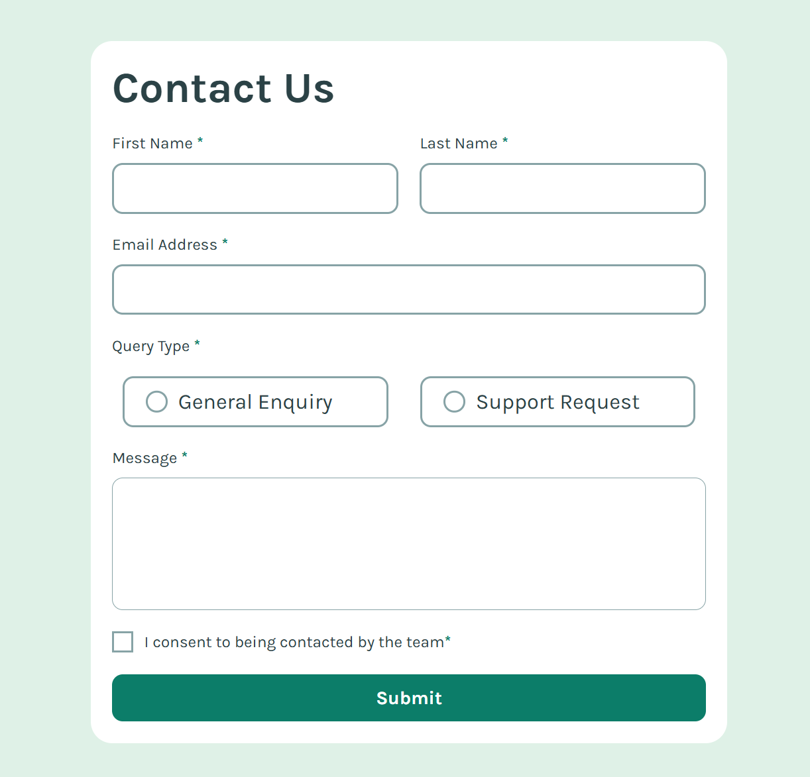
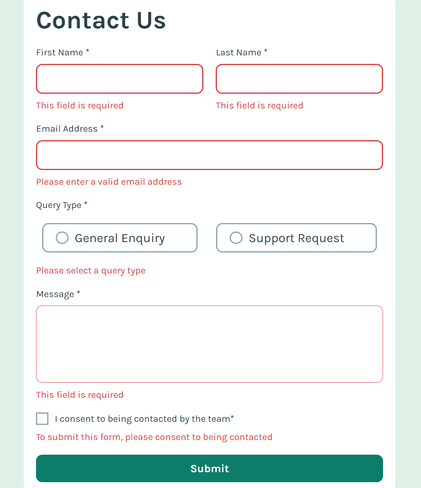

# Frontend Mentor - Contact form solution

This is a solution to the [Contact form challenge on Frontend Mentor](https://www.frontendmentor.io/challenges/contact-form--G-hYlqKJj). Frontend Mentor challenges help you improve your coding skills by building realistic projects. 

## Table of contents

- [Overview](#overview)
  - [The challenge](#the-challenge)
  - [Screenshot](#screenshot)
  - [Links](#links)
- [My process](#my-process)
  - [Built with](#built-with)
  - [What I learned](#what-i-learned)

## Overview

### The challenge

Users should be able to:

- Complete the form and see a success toast message upon successful submission
- Receive form validation messages if:
  - A required field has been missed
  - The email address is not formatted correctly
- Complete the form only using their keyboard
- Have inputs, error messages, and the success message announced on their screen reader
- View the optimal layout for the interface depending on their device's screen size
- See hover and focus states for all interactive elements on the page

### Screenshot




### Links

- Solution URL: [https://github.com/hrong1/Contact-form](https://github.com/hrong1/Contact-form)
- Live Site URL: [https://hrong1.github.io/Contact-form/](https://hrong1.github.io/Contact-form/)

## My process

### Built with

- Semantic HTML5 markup
- CSS custom properties
- Flexbox
- CSS Grid
- Mobile-first workflow

### What I learned

Learn use `<dialog>` for the popup message

```html
<dialog class="success-message" id="success-message">
  <h3 class="success-message__title">
    
    Message Sent!
  </h3>
  <p class="success-message__statement">
    Thanks for completing the form. We'll be in touch soon!
  </p>
</dialog>
```
```js
form.addEventListener('submit', (event) => {
    event.preventDefault();
    const isFormValid = checkFormValid();
    if (isFormValid) {
        form.reset();
        successDialog.showModal();
        setTimeout(() => {
            successDialog.close();
            
        }, 5000);
    }
});
```
